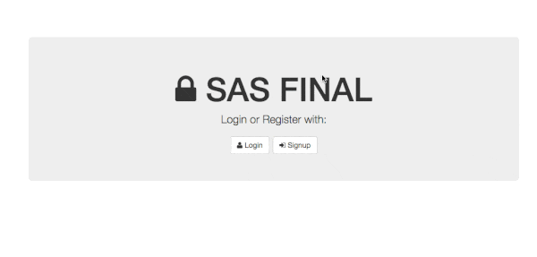

# Nmap and Iptables

A simple project to control nmap and iptables over web interface.

### How to use

- `npm install`: to install all deppendencies
- `sudo mongod`: to start mongodb, we use to create users
- `node server.js`: to start a server
- `localhost:8080`: to see in the browser